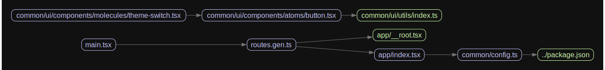

<!-- markdownlint-disable MD033  -->

#  Ramen

[ 🚧 WIP ]

Offline-first scalable battle-tested React app template. Just add water.

## Architecture

### Dependency graph



## Development

### Prerequisites

Install `mise` version manager or make sure that it's already installed:

<https://mise.jdx.dev/getting-started.html>

### Installing required tools and dependencies

```sh
mise trust; mise i && npm run setup
```

### Installing shadcn/ui components

```sh
pnpm add:shadcn-ui component-name
```

### Running development server

```sh
pnpm dev
```

## CI/CD

### Building production bundle

```sh
pnpm build
```

### Running local preview for QA

```sh
pnpm preview
```
